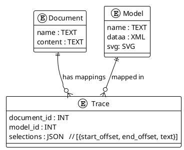

```plantuml
@startuml
!theme plain

entity "Document" as Document {
  name : TEXT
  content : TEXT
}

entity "Model" as Model {
  name : TEXT
  dataa : XML
  svg: SVG
}

entity "Trace" as Trace {
  document_id : INT
  model_id : INT
  selections : JSON   // [{start_offset, end_offset, text}]
}

' --- Relationships ---
Document ||--o{ Trace : "has mappings"
Model ||--o{ Trace : "mapped in"

@enduml
```