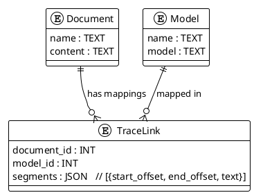

```plantuml
@startuml
!theme plain

entity "Document" as Document {
  name : TEXT
  content : TEXT
}

entity "Model" as Model {
  name : TEXT
  model : TEXT
}

entity "TraceLink" as TraceLink {
  document_id : INT
  model_id : INT
  segments : JSON   // [{start_offset, end_offset, text}]
}

' --- Relationships ---
Document ||--o{ TraceLink : "has mappings"
Model ||--o{ TraceLink : "mapped in"

@enduml
```