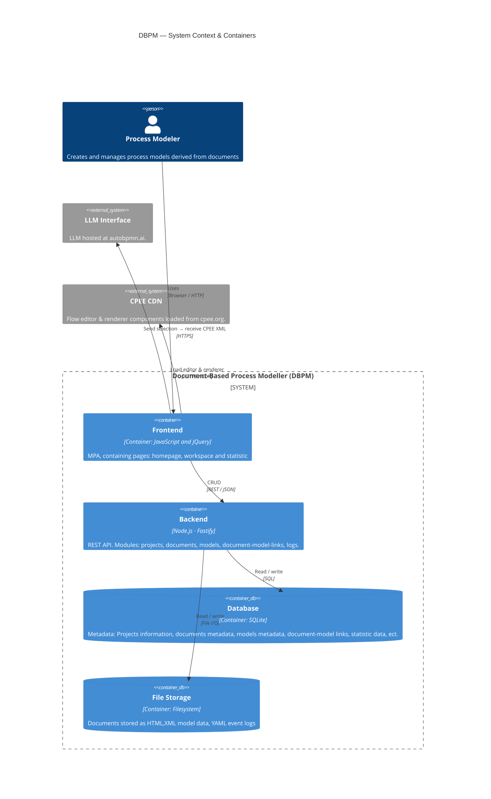
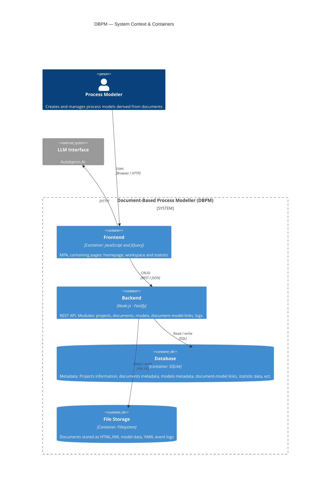

```mermaid
C4Container
    title DBPM — System Context & Containers

    Person(user, "Process Modeler", "Creates and manages process models derived from documents")

    System_Ext(llm, "LLM Interface", "LLM hosted at autobpmn.ai.")
    System_Ext(cpee, "CPEE CDN", "Flow editor & renderer components loaded from cpee.org.")

    System_Boundary(dbpm, "Document-Based Process Modeller (DBPM)") {
        Container(frontend, "Frontend", "Container: JavaScript and JQuery", "MPA, containing pages: homepage, workspace and statistic")
        Container(backend, "Backend", "Node.js · Fastify", "REST API. Modules: projects, documents, models, document-model-links, logs.")
        ContainerDb(sqlite, "Database", "Container: SQLite", "Metadata: Projects information, documents metadata, models metadata, document-model links, statistic data, ect.")
        ContainerDb(files, "File Storage", "Container: Filesystem", "Documents stored as HTML,XML model data, YAML event logs")
    }

    Rel(user, frontend, "Uses", "Browser / HTTP")
    Rel(frontend, backend, "CRUD", "REST / JSON")
    Rel(backend, sqlite, "Read / write", "SQL")
    Rel(backend, files, "Read / write", "File I/O")
    Rel(frontend, llm, "Send selection → receive CPEE XML", "HTTPS")
    Rel(frontend, cpee, "Load editor & renderer", "HTTPS / CDN")
```

V1

```mermaid
C4Container
    title DBPM — System Context & Containers

    Person(user, "Process Modeler", "Creates and manages process models derived from documents")

    System_Ext(llm, "LLM Interface", "Autobpmn.AI.")

    System_Boundary(dbpm, "Document-Based Process Modeller (DBPM)") {
        Container(frontend, "Frontend", "Container: JavaScript and JQuery", "MPA, containing pages: homepage, workspace and statistic")
        Container(backend, "Backend", "Node.js · Fastify", "REST API. Modules: projects, documents, models, document-model-links, logs.")
        ContainerDb(sqlite, "Database", "Container: SQLite", "Metadata: Projects information, documents metadata, models metadata, document-model links, statistic data, ect.")
        ContainerDb(files, "File Storage", "Container: Filesystem", "Documents stored as HTML,XML model data, YAML event logs")
    }

    Rel(user, frontend, "Uses", "Browser / HTTP")
    Rel(frontend, backend, "CRUD", "REST / JSON")
    Rel(backend, sqlite, "Read / write", "SQL")
    Rel(backend, files, "Read / write", "File I/O")
    Rel(frontend, llm, "", "HTTP")
```