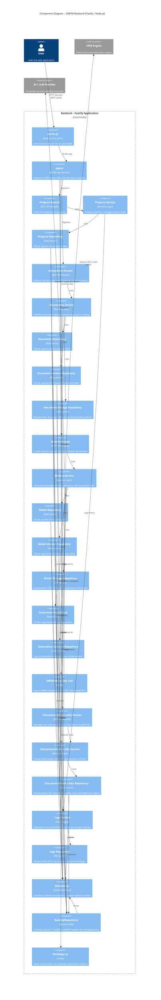

```mermaid
C4Component
title Component Diagram – DBPM Backend (Fastify / Node.js)

Person(user, "User", "Uses the web application")

System_Ext(cpee, "CPEE Engine", "External process execution engine")
System_Ext(aiProvider, "AI / LLM Provider", "Generates process models from text")

Container_Boundary(backend, "Backend – Fastify Application") {

    Component(server, "server.js", "Node.js entry point", "Starts the Fastify server on port 6688")
    Component(app, "app.js", "Fastify App Factory", "Registers CORS, static files, and all route modules")

    Component(projectsRoutes, "Projects Routes", "REST API Module", "CRUD for projects via /projects")
    Component(projectsService, "Projects Service", "Business Logic", "Creates projects, manages project state")
    Component(projectsRepo, "Projects Repository", "Data Access", "SQLite queries for projects table")

    Component(documentsRoutes, "Documents Routes", "REST API Module", "Upload, version, restore documents via /documents")
    Component(documentsService, "Documents Service", "Business Logic", "Handles document upload, versioning, word counting")
    Component(documentRepo, "Document Repository", "Data Access", "SQLite queries for documents table")
    Component(documentVersionRepo, "Document Version Repository", "Data Access", "SQLite queries for document_versions table")
    Component(documentStorageRepo, "Document Storage Repository", "File System", "Reads/writes document files to persistence/documents/")

    Component(modelsRoutes, "Models Routes", "REST API Module", "Create, version, restore process models via /models")
    Component(modelsService, "Models Service", "Business Logic", "Generates/manages models, enriches with document links")
    Component(modelRepo, "Model Repository", "Data Access", "SQLite queries for models table")
    Component(modelVersionRepo, "Model Version Repository", "Data Access", "SQLite queries for model_versions table")
    Component(modelStorageRepo, "Model Storage Repository", "File System", "Reads/writes CPEE XML files to persistence/models/")
    Component(subprocessRepo, "Subprocess Repository", "Data Access", "Tracks subprocess link configurations")
    Component(generationAttemptRepo, "Generation Attempt Repository", "Data Access", "Logs AI generation attempts per model version")
    Component(dbpmMetaXml, "DBPM Meta XML Util", "Utility", "Injects DBPM metadata into CPEE XML model files")

    Component(linksRoutes, "Document-Model Links Routes", "REST API Module", "Manage text-selection links via /document-model-links")
    Component(linksService, "Document-Model Links Service", "Business Logic", "Creates and copies links with text-position anchors")
    Component(linksRepo, "Document-Model Links Repository", "Data Access", "SQLite queries for document_model_links and selections tables")

    Component(logsService, "Logs Service", "Event Logger", "Appends structured JSON events to per-project log files")
    Component(logsRepo, "Logs Repository", "File System", "Reads/writes JSON log entries to persistence/logs/")

    Component(database, "database.js", "SQLite Database", "Initialises schema and exports a better-sqlite3 instance")
    Component(baseSqlRepo, "BaseSqlRepository", "Shared Utility", "Common SELECT / INSERT / UPDATE helpers for all repositories")
    Component(fileHelper, "fileHelper.js", "Utility", "Word-count helper for uploaded document content")
}

Rel(user, server, "HTTP requests", "REST / JSON")
Rel(server, app, "Builds app")
Rel(app, projectsRoutes, "Registers")
Rel(app, documentsRoutes, "Registers")
Rel(app, modelsRoutes, "Registers")
Rel(app, linksRoutes, "Registers")

Rel(projectsRoutes, projectsService, "Calls")
Rel(projectsService, projectsRepo, "Uses")
Rel(projectsService, logsService, "Logs events")
Rel(projectsRepo, baseSqlRepo, "Extends")
Rel(projectsRepo, database, "Queries")

Rel(documentsRoutes, documentsService, "Calls")
Rel(documentsService, documentRepo, "Uses")
Rel(documentsService, documentVersionRepo, "Uses")
Rel(documentsService, documentStorageRepo, "Uses")
Rel(documentsService, logsService, "Logs events")
Rel(documentsService, fileHelper, "Count words")
Rel(documentRepo, baseSqlRepo, "Extends")
Rel(documentRepo, database, "Queries")
Rel(documentVersionRepo, baseSqlRepo, "Extends")
Rel(documentVersionRepo, database, "Queries")

Rel(modelsRoutes, modelsService, "Calls")
Rel(modelsService, modelRepo, "Uses")
Rel(modelsService, modelVersionRepo, "Uses")
Rel(modelsService, modelStorageRepo, "Uses")
Rel(modelsService, subprocessRepo, "Uses")
Rel(modelsService, generationAttemptRepo, "Uses")
Rel(modelsService, linksService, "Uses")
Rel(modelsService, logsService, "Logs events")
Rel(modelsService, dbpmMetaXml, "Injects metadata")
Rel(modelRepo, baseSqlRepo, "Extends")
Rel(modelRepo, database, "Queries")
Rel(modelVersionRepo, baseSqlRepo, "Extends")
Rel(modelVersionRepo, database, "Queries")
Rel(modelsService, aiProvider, "Requests model generation", "HTTP / AI API")
Rel(modelsService, cpee, "Deploys XML model", "HTTP")

Rel(linksRoutes, linksService, "Calls")
Rel(linksService, linksRepo, "Uses")
Rel(linksRepo, baseSqlRepo, "Extends")
Rel(linksRepo, database, "Queries")

Rel(logsService, logsRepo, "Uses")

Rel(baseSqlRepo, database, "Wraps")
```