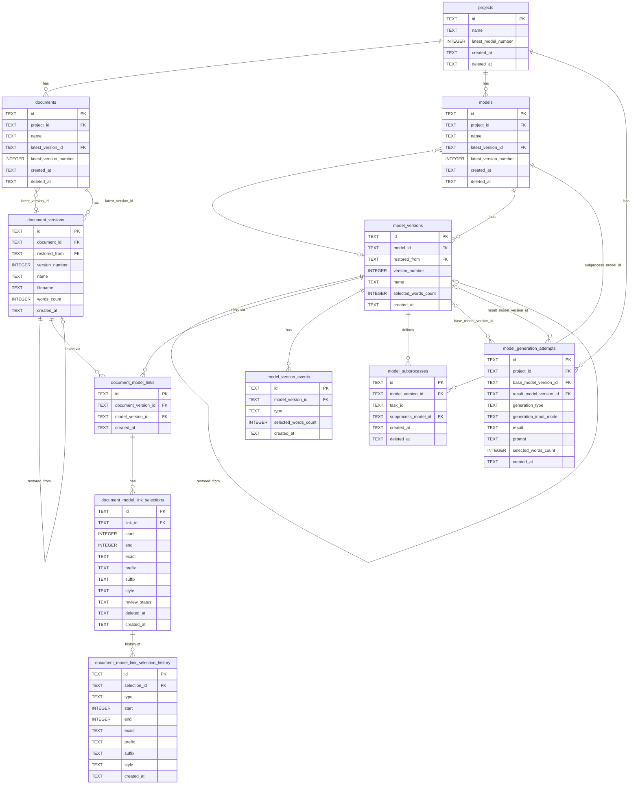

```mermaid
erDiagram
    projects {
        TEXT id PK
        TEXT name
        INTEGER latest_model_number
        TEXT created_at
        TEXT deleted_at
    }

    documents {
        TEXT id PK
        TEXT project_id FK
        TEXT name
        TEXT latest_version_id FK
        INTEGER latest_version_number
        TEXT created_at
        TEXT deleted_at
    }

    document_versions {
        TEXT id PK
        TEXT document_id FK
        TEXT restored_from FK
        INTEGER version_number
        TEXT name
        TEXT filename
        INTEGER words_count
        TEXT created_at
    }

    models {
        TEXT id PK
        TEXT project_id FK
        TEXT name
        TEXT latest_version_id FK
        INTEGER latest_version_number
        TEXT created_at
        TEXT deleted_at
    }

    model_versions {
        TEXT id PK
        TEXT model_id FK
        TEXT restored_from FK
        INTEGER version_number
        TEXT name
        INTEGER selected_words_count
        TEXT created_at
    }

    document_model_links {
        TEXT id PK
        TEXT document_version_id FK
        TEXT model_version_id FK
        TEXT created_at
    }

    document_model_link_selections {
        TEXT id PK
        TEXT link_id FK
        INTEGER start
        INTEGER end
        TEXT exact
        TEXT prefix
        TEXT suffix
        TEXT style
        TEXT review_status
        TEXT deleted_at
        TEXT created_at
    }

    document_model_link_selection_history {
        TEXT id PK
        TEXT selection_id FK
        TEXT type
        INTEGER start
        INTEGER end
        TEXT exact
        TEXT prefix
        TEXT suffix
        TEXT style
        TEXT created_at
    }

    model_version_events {
        TEXT id PK
        TEXT model_version_id FK
        TEXT type
        INTEGER selected_words_count
        TEXT created_at
    }

    model_generation_attempts {
        TEXT id PK
        TEXT project_id FK
        TEXT base_model_version_id FK
        TEXT result_model_version_id FK
        TEXT generation_type
        TEXT generation_input_mode
        TEXT result
        TEXT prompt
        INTEGER selected_words_count
        TEXT created_at
    }

    model_subprocesses {
        TEXT id PK
        TEXT model_version_id FK
        TEXT task_id
        TEXT subprocess_model_id FK
        TEXT created_at
        TEXT deleted_at
    }

    projects ||--o{ documents : "has"
    projects ||--o{ models : "has"
    projects ||--o{ model_generation_attempts : "has"

    documents }o--o| document_versions : "latest_version_id"
    documents ||--o{ document_versions : "has"
    document_versions ||--o| document_versions : "restored_from"

    models }o--o| model_versions : "latest_version_id"
    models ||--o{ model_versions : "has"
    model_versions ||--o| model_versions : "restored_from"

    document_versions ||--o{ document_model_links : "linked via"
    model_versions ||--o{ document_model_links : "linked via"

    document_model_links ||--o{ document_model_link_selections : "has"
    document_model_link_selections ||--o{ document_model_link_selection_history : "history of"

    model_versions ||--o{ model_version_events : "has"
    model_versions ||--o{ model_subprocesses : "defines"
    models ||--o{ model_subprocesses : "subprocess_model_id"

    model_versions |o--o{ model_generation_attempts : "base_model_version_id"
    model_versions |o--o{ model_generation_attempts : "result_model_version_id"
```