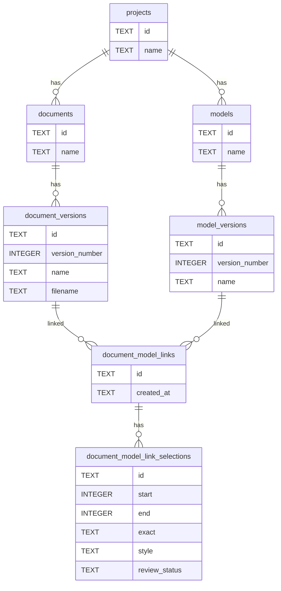

```mermaid
erDiagram
    projects {
        TEXT id
        TEXT name
    }

    documents {
        TEXT id
        TEXT name
    }

    document_versions {
        TEXT id
        INTEGER version_number
        TEXT name
        TEXT filename
    }

    models {
        TEXT id
        TEXT name
    }

    model_versions {
        TEXT id
        INTEGER version_number
        TEXT name
    }

    document_model_links {
        TEXT id
        TEXT created_at
    }

    document_model_link_selections {
        TEXT id
        INTEGER start
        INTEGER end
        TEXT exact
        TEXT style
        TEXT review_status
    }

    projects ||--o{ documents : has
    projects ||--o{ models : has

    documents ||--o{ document_versions : has
    models ||--o{ model_versions : has

    document_versions ||--o{ document_model_links : linked
    model_versions ||--o{ document_model_links : linked

    document_model_links ||--o{ document_model_link_selections : has
```