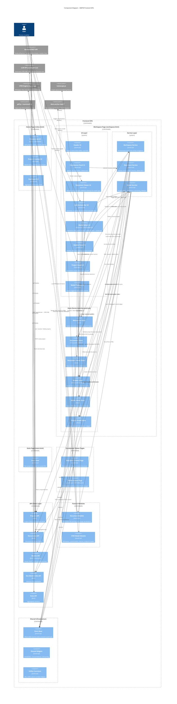

```mermaid
C4Component
    title Component Diagram – DBPM Frontend SPA

    Person(user, "User", "Process modeller")

    System_Ext(backend,   "Backend REST API",       "Node.js/Express – projects, documents, models, links")
    System_Ext(llmAPI,    "LLM API (autobpmn.ai)",  "Generates CPEE XML from selected process text")
    System_Ext(cpeeEng,   "CPEE Engine (cpee.org)", "WfAdaptor libs, base themes & rendering")
    System_Ext(cytoscape, "Cytoscape.js",           "Graph layout & rendering library")
    System_Ext(pdfLib,    "pdf.js / mammoth.js",    "Client-side PDF & DOCX parsing")
    System_Ext(anchorLib, "dom-anchor-text-*",      "Text-range serialization / deserialization")

    Container_Boundary(spa, "Frontend SPA") {

        Container_Boundary(homePage, "Home Page  (index.html)") {
            Component(projectsListUI,   "Projects List UI",    "jQuery / DataTables", "Lists projects; open, rename, delete")
            Component(projectCreateUI,  "Project Creation UI", "JavaScript",          "Modal dialog; creates a new project")
            Component(dashboardUI,      "Dashboard UI",        "JavaScript",          "Aggregate KPI metrics panel")
        }

        Container_Boundary(workspacePage, "Workspace Page  (workspace.html)") {

            Boundary(uiLayer, "UI Layer") {
                Component(headerUI,       "Header UI",           "JavaScript", "Project name inline-editor, nav links")
                Component(docsUI,         "Documents Panel UI",  "JavaScript", "Upload, list, bulk-select, delete docs")
                Component(docViewerUI,    "Document Viewer UI",  "JavaScript", "Renders text; manages selection overlays & model tags")
                Component(linkActionsUI,  "Link Actions Bar UI", "JavaScript", "Generate / re-generate model from text selection")
                Component(modelEditorUI,  "Model Editor UI",     "JavaScript / CPEE WfAdaptor", "Interactive CPEE graph canvas + prompt pane + review bar")
                Component(modelsUI,       "Models Panel UI",     "JavaScript", "Browse, filter and manage process models")
                Component(graphUI,        "Project Graph UI",    "Cytoscape.js", "Document–model relationship graph")
                Component(popoverUI,      "Model Popover UI",    "JavaScript", "Hover-triggered SVG model preview")
            }

            Boundary(serviceLayer, "Service Layer") {
                Component(wsSvc,    "Workspace Service", "JavaScript", "Orchestrates load, cross-entity navigation")
                Component(docSvc,   "Document Service",  "JavaScript", "Upload, version-load, rename, delete docs")
                Component(modelSvc, "Model Service",     "JavaScript", "AI generation, refinement, versioning, deletion")
            }

            Boundary(storeLayer, "State Stores  (reactive pub/sub)") {
                Component(wsStore,          "Workspace Store",        "Store", "Active document & model; global UI state")
                Component(docsStore,        "Documents Store",        "VersionedEntityStore", "Document entities & version list")
                Component(docViewerStore,   "Document Viewer Store",  "Store", "Text selections & link-draft state")
                Component(modelsStore,      "Models Store",           "VersionedEntityStore", "Model entities, versions & SVG cache")
                Component(modelEditorStore, "Model Editor Store",     "Store", "Active CPEE XML data & editor status")
                Component(graphStore,       "Project Graph Store",    "Store", "Cytoscape element set (nodes + edges)")
            }
        }

        Container_Boundary(statsPage, "Stats Page  (stats.html)") {
            Component(statsUI, "Stats View", "JavaScript", "Per-project document & model KPIs")
        }

        Container_Boundary(standalonePages, "Standalone Viewer Pages") {
            Component(docViewerPage,   "Document Viewer Page",  "JavaScript", "Shareable read-only annotated document")
            Component(modelViewerPage, "Model Viewer Page",     "JavaScript / CPEE WfAdaptor", "Embeddable model preview (iframe target)")
        }

        Container_Boundary(apiLayer, "API Client Layer") {
            Component(projectsAPI,  "Projects API",        "fetch", "Project CRUD & component listing")
            Component(documentsAPI, "Documents API",       "fetch", "Document & version CRUD")
            Component(modelsAPI,    "Models API",          "fetch / jQuery.ajax", "Model CRUD + LLM generation proxy")
            Component(linksAPI,     "Doc-Model Links API", "fetch", "Selection link read/write")
            Component(statsAPI,     "Stats API",           "fetch", "Aggregated statistics")
        }

        Container_Boundary(featureModules, "Feature Modules") {
            Component(docModule,   "Document Module",   "JavaScript", "PDF/DOCX file parsing; text-range serialization")
            Component(modelModule, "CPEE Model Module", "JavaScript", "WfAdaptor customization, themes, endpoint loader")
        }

        Container_Boundary(sharedInfra, "Shared Infrastructure") {
            Component(storeBase, "Store Base",         "JavaScript", "Observable reactive state container (pub/sub)")
            Component(widgets,   "Shared Widgets",     "JavaScript", "InlineEditor, VersionSelector, VersionTag")
            Component(utils,     "Utility Functions",  "JavaScript", "URL, DOM, date & number helpers")
        }
    }

    %% ── User entry points ────────────────────────────────────────────────────
    Rel(user, projectsListUI,  "Manages projects",           "Browser")
    Rel(user, docViewerUI,     "Reads & selects text",       "Browser")
    Rel(user, modelEditorUI,   "Edits process model",        "Browser")
    Rel(user, linkActionsUI,   "Triggers AI generation",     "Browser")
    Rel(user, graphUI,         "Explores project graph",     "Browser")

    %% ── Home page ────────────────────────────────────────────────────────────
    Rel(projectsListUI,  projectsAPI, "List / rename / delete projects")
    Rel(projectCreateUI, projectsAPI, "POST create project")
    Rel(dashboardUI,     projectsAPI, "Fetch overview stats")

    %% ── Workspace bootstrap ──────────────────────────────────────────────────
    Rel(wsSvc, projectsAPI,  "Validate project & load components")
    Rel(wsSvc, docsStore,    "Init document entities")
    Rel(wsSvc, modelsStore,  "Init model entities")
    Rel(wsSvc, graphStore,   "Init Cytoscape elements")
    Rel(wsSvc, wsStore,      "Set active document & model")

    %% ── Document flow ────────────────────────────────────────────────────────
    Rel(docsUI,      docSvc,    "Upload / rename / delete")
    Rel(docsUI,      docsStore, "Subscribe – render list")
    Rel(docSvc,      documentsAPI, "CRUD document & versions")
    Rel(docSvc,      docModule,   "Parse file to HTML")
    Rel(docSvc,      docsStore,   "Add / update / delete entity")
    Rel(docSvc,      graphStore,  "Sync document graph node")
    Rel(docViewerUI, docViewerStore, "Read & write text selections")
    Rel(docViewerUI, wsStore,       "Read active document version")

    %% ── Model generation & editing ───────────────────────────────────────────
    Rel(linkActionsUI,  modelSvc,       "Trigger generate / regenerate")
    Rel(linkActionsUI,  docViewerStore, "Read current selection")
    Rel(modelSvc,       modelsAPI,      "Create model & versions")
    Rel(modelsAPI,      llmAPI,         "POST selected text → CPEE XML")
    Rel(modelSvc,       linksAPI,       "Create / update selection links")
    Rel(modelSvc,       modelsStore,    "Update model state & SVG cache")
    Rel(modelSvc,       modelEditorStore, "Set XML data & editor status")
    Rel(modelSvc,       graphStore,     "Sync model graph node & edges")
    Rel(modelEditorUI,  modelModule,    "Render CPEE XML via WfAdaptor")
    Rel(modelEditorUI,  modelEditorStore, "Read / write active XML")
    Rel(modelEditorUI,  modelSvc,       "Save version on manual edit")

    %% ── Models panel & popovers ──────────────────────────────────────────────
    Rel(modelsUI,   modelsStore, "Subscribe – render model list")
    Rel(modelsUI,   modelSvc,   "Delete / rename model")
    Rel(modelsUI,   wsSvc,      "Open model in editor")
    Rel(popoverUI,  modelsStore, "Read cached SVG for preview")
    Rel(popoverUI,  modelSvc,   "Load model SVG on demand")

    %% ── Project graph ────────────────────────────────────────────────────────
    Rel(graphUI, graphStore,  "Subscribe – update Cytoscape elements")
    Rel(graphUI, cytoscape,   "Render nodes & edges")
    Rel(graphUI, wsSvc,       "Navigate on node click")

    %% ── Stats page ───────────────────────────────────────────────────────────
    Rel(statsUI, statsAPI,    "Fetch aggregated stats")
    Rel(statsUI, projectsAPI, "Fetch components list")

    %% ── Standalone viewer pages ──────────────────────────────────────────────
    Rel(docViewerPage,   documentsAPI, "Fetch document HTML content")
    Rel(docViewerPage,   linksAPI,     "Fetch selection annotations")
    Rel(modelViewerPage, cpeeEng,      "Load WfAdaptor & theme")

    %% ── Feature modules ──────────────────────────────────────────────────────
    Rel(docModule,   pdfLib,    "Render PDF / DOCX to HTML")
    Rel(docModule,   anchorLib, "Serialize / deserialize text ranges")
    Rel(modelModule, cpeeEng,   "Extend & customize WfAdaptor")

    %% ── API → Backend ────────────────────────────────────────────────────────
    Rel(projectsAPI,  backend, "HTTP/JSON")
    Rel(documentsAPI, backend, "HTTP/JSON")
    Rel(modelsAPI,    backend, "HTTP/JSON")
    Rel(linksAPI,     backend, "HTTP/JSON")
    Rel(statsAPI,     backend, "HTTP/JSON")

    %% ── Shared infrastructure ────────────────────────────────────────────────
    Rel(wsStore,          storeBase, "extends")
    Rel(docsStore,        storeBase, "extends")
    Rel(docViewerStore,   storeBase, "extends")
    Rel(modelsStore,      storeBase, "extends")
    Rel(modelEditorStore, storeBase, "extends")
    Rel(graphStore,       storeBase, "extends")
```